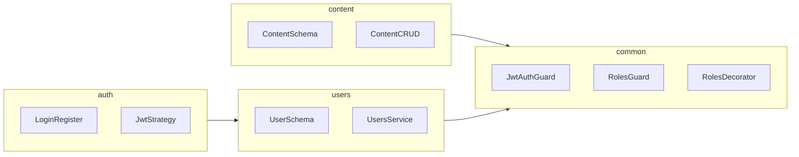

# Plan de implementación según [AI_CONTEXT.md](c:\Users\alexe\OneDrive\Documentos\proyectos\cms-api\AI_CONTEXT.md)

## Contexto y comprobación previa

- **Stack ya declarado en dependencias** ([package.json](c:\Users\alexe\OneDrive\Documentos\proyectos\cms-api\package.json)): NestJS 11, `@nestjs/mongoose`, `mongoose`, `@nestjs/jwt`, `@nestjs/passport`, `passport-jwt`, `bcrypt`, `class-validator` / `class-transformer`, `@nestjs/swagger`, `@nestjs/config`.
- **Verificar** que exista el esqueleto Nest en `src/` (`main.ts`, `app.module.ts`). Si falta (p. ej. solo hay tests que importan `src`), regenerar o restaurar el proyecto Nest antes de seguir; el e2e actual referencia [test/app.e2e-spec.ts](c:\Users\alexe\OneDrive\Documentos\proyectos\cms-api\test\app.e2e-spec.ts) con prefijo global `api`.

## Arquitectura objetivo (módulos)

Más adelante, alinear con la estructura del doc: módulos [settings](c:\Users\alexe\OneDrive\Documentos\proyectos\cms-api\AI_CONTEXT.md) y [messages](c:\Users\alexe\OneDrive\Documentos\proyectos\cms-api\AI_CONTEXT.md) en rutas dedicadas.

## Reglas transversales (aplicar en cada hito)

- **DTOs** con `class-validator` para todas las entradas; **Swagger** decorando controladores/DTOs donde aplique.
- **Autorización:** `@UseGuards(JwtAuthGuard, RolesGuard)` y `@Roles(Role.ADMIN)` según [sección 5](c:\Users\alexe\OneDrive\Documentos\proyectos\cms-api\AI_CONTEXT.md).
- **Multiusuario y correo:** el JWT debe llevar identidad estable (`sub` = user id y/o `email`). Para **USER**, filtrar listados y operaciones para que solo afecten recursos cuyo propietario coincide con ese usuario (p. ej. `Content.author` = `req.user.id`, o un campo `ownerEmail` alineado con el correo del token si se exige “vincular todo a un correo” de forma explícita en colecciones sin `User` ref). **ADMIN** sin ese filtro (lectura/escritura global según endpoint).
- Errores con `HttpException` / excepciones HTTP de Nest con mensajes claros.

---

### Hito 1 — Infraestructura (backlog 1.1–1.3)

| Ítem | Acción concreta |
|------|-------------------|
| 1.1 | `MongooseModule.forRootAsync` con URI desde `ConfigService`; módulo raíz importando `ConfigModule.forRoot({ isGlobal: true, envFilePath: '.env' })`. |
| 1.2 | Variables en [.env.example](c:\Users\alexe\OneDrive\Documentos\proyectos\cms-api\.env.example): `MONGODB_URI`, `JWT_SECRET`, `JWT_EXPIRES_IN` (u otras que uses), puerto; validación opcional con esquema Joi o variables tipadas. |
| 1.3 | En `main.ts`: `ValidationPipe` global (`whitelist`, `forbidNonWhitelisted`), prefijo global `api` (coherente con e2e), `DocumentBuilder` + `SwaggerModule.setup` (título/version). |

---

### Hito 2 — Auth y seguridad (backlog 2.1–2.4)

| Ítem | Acción concreta |
|------|-------------------|
| 2.1 | Esquema **User** Mongoose según [sección 4](c:\Users\alexe\OneDrive\Documentos\proyectos\cms-api\AI_CONTEXT.md): `email` único, `password` con `select: false`, `roles` por defecto `['USER']`, `profile`, `sections`. Servicio de usuarios con hash **bcrypt** en registro/actualización de contraseña. |
| 2.2 | Módulo **Auth**: `POST /auth/register`, `POST /auth/login` que devuelve JWT; estrategia **Passport JWT** (`passport-jwt`) leyendo payload estándar (`sub`, `email`, `roles`). |
| 2.3 | `JwtAuthGuard` registrado globalmente o por ruta; payload tipado (`Req()` con usuario). |
| 2.4 | Enum `Role` (ADMIN, USER), `RolesGuard` que lea metadata de `@Roles()`, decorador `@Roles(...)` en [common](c:\Users\alexe\OneDrive\Documentos\proyectos\cms-api\AI_CONTEXT.md). |

---

### Hito 3 — Motor CMS (backlog 3.1–3.3)

| Ítem | Acción concreta |
|------|-------------------|
| 3.1 | Esquema **Content**: campos del doc (`title`, `body`, `type` Post/SERVICES, `author` ref User, `status` DRAFT/PUBLISHED, `keywords`, `links`, `refs`, timestamps). CRUD en controlador con DTOs create/update/query. |
| 3.2 | En create/update de contenido, **asignar `author`** desde `req.user.id` (no confiar en el body para USER); ADMIN puede crear en nombre de otro solo si lo defines así en DTO (si no, mismo criterio para todos). |
| 3.3 | Listado con **paginación** (`page`, `limit`) y **filtros** (p. ej. `status`, `type`, búsqueda por texto en `title`/`keywords` con `$regex` escapado o índice de texto si escalas). Aplicar filtro de alcance: USER solo ve/edita sus contenidos; ADMIN ve todo. |

---

### Extensión recomendada (estructura §2, fuera del backlog numerado)

- **Settings:** esquema `key` + `value`; CRUD restringido a **ADMIN**; lectura pública opcional por `key` si el front lo necesita (decisión de producto).
- **Messages:** esquema contacto (`name`, `email`, `message`, `phone`, `businessName`); **POST** público para enviar; **GET**/delete solo **ADMIN** (o USER solo sus envíos si añades `ownerEmail` y política acorde a la regla del correo).

Tras implementar, **actualizar [AI_CONTEXT.md](c:\Users\alexe\OneDrive\Documentos\proyectos\cms-api\AI_CONTEXT.md)** según la skill `/plan`: marcar ítems del backlog completados, añadir notas breves (prefijo API, convención de ownership por email) sin duplicar código largo.

## Orden sugerido de trabajo

1. Hito 1 (app arranca contra Mongo + Swagger visible).  
2. Hito 2 (registro/login + guards).  
3. Hito 3 (contenido end-to-end con reglas de rol).  
4. Settings/Messages si el alcance lo incluye.  
5. Ajustar e2e ([test/app.e2e-spec.ts](c:\Users\alexe\OneDrive\Documentos\proyectos\cms-api\test\app.e2e-spec.ts)) a rutas reales bajo `/api` y flujos críticos (auth + contenido).
